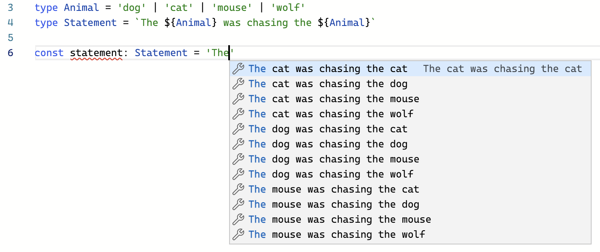

# Template Literal Types

One of the newest language features, **template literal types** is an extension of string literal types. These type definitions can expand into many different string literals using some nifty set logic. Template literal types use the same template literal syntax from JavaScript. Except, type references can be passed to the `${}` sequence and will be evaluated by the TypeScript compiler.

```ts
type Animal = 'dog' | 'cat' | 'mouse' | 'wolf'
type Statement = `The ${Animal} was chasing the ${Animal}`
```

When implementing the `Statement` type, any combination of the `Animal` types and the rest of the `Statement` are considered valid.



Aside from a silly story generator, how are these types useful?

From the TypeScript [version 4.1](https://devblogs.microsoft.com/typescript/announcing-typescript-4-1/#template-literal-types) announcement blog, consider a function `setAlignment` that may be used to modify the positioning of a DOM element using CSS alignment properties.

```ts
type VerticalAlignment = "top" | "middle" | "bottom";
type HorizontalAlignment = "left" | "center" | "right";

// Takes
//   | "top-left"    | "top-center"    | "top-right"
//   | "middle-left" | "middle-center" | "middle-right"
//   | "bottom-left" | "bottom-center" | "bottom-right"
declare function setAlignment(value: `${VerticalAlignment}-${HorizontalAlignment}`): void;
```

Rather than having to write out each possible combination of vertical and horizontal alignment combinations, template literal types makes it easy to define an argument that only accepts the 9 valid arrangements.

## Parsing

In preparation for this section's challenge lets go over what it take to build a trivial parser using Template Literal Types.

Consider the stringified JSON object `'{ "foo": "bar" }'`. In JavaScript you can use `JSON.parse` to get the resulting JSON object:

```js
const str = '{ "foo": "bar" }'
const obj = JSON.parse(str)
console.log(obj.foo) // -> "bar"
```

In TypeScript, `JSON.parse` isn't very smart, and the resulting `obj` has an `any` return type. Let's imporve this a little bit by writing a new type `ParseJSON` that will derive the key value from `str`.

```ts
type ParseJSON<S extends string> =
  S extends `{ "${infer Key}": "${infer Value}" }`
    ? { [k in Key]: unknown }
    : never
```

Now, we can use some type casting to derive the key values of the JSON object!

```ts
const str = '{ "foo": "bar" }'
const obj = JSON.parse(str) as ParseJSON<typeof str>
// typeof obj -> { foo: unknown }
```

What if the `str` had multiple entires?

```ts
const str2 = `{ "foo": "bar", "fuzz": "buzz" }`
```

We have to modify `ParseJSON` in order to _recursively_ parse each entry in the string.

```ts
type ParseJSON<S extends string> =
  S extends `${infer Start}"${infer Key}": "${infer Value}",${infer Rest}`
          | `"${infer Key}": "${infer Value}",${infer Rest}`
    ? { [k in Key | keyof ParseJSON<Rest>]: unknown }
    : S extends `${infer Start}"${infer Key}": "${infer Value}" }`
              | `"${infer Key}": "${infer Value}" }`
      ? { [k in Key]: unknown }
      : never;
```

Now the `ParseJSON` type supports multiple entries!

```ts
const str = '{ "foo": "bar" }'
const obj = JSON.parse(str) as ParseJSON<typeof str>

const str2 = `{ "foo": "bar", "fuzz": "buzz" }`
const obj2 = JSON.parse(str2) as ParseJSON<typeof str2>

const str3 = `{ "foo": "bar", "fuzz": "buzz", "abc": "xyz" }`
const obj3 = JSON.parse(str3) as ParseJSON<typeof str3>
```

View on [TypeScript Playground](https://www.typescriptlang.org/play?#code/C4TwDgpgBACghgJwM4QFIGUDyA5APOqCAD2AgDsATJKJYBASzIHMA+KAXgFgAoKPqAsVKVqAAwAkAb0YAzCAgHBEwAL4AiKbPlQA0hBDqAXFA3SychQDU4AGwCuEdQBpN57QCUItFaKgAfKFFTLQU9AzVjYLcrWwdnVwsoT29RHn50qAB+KEkoAG0AayhGXX1-KAL9AHsZWEQUDBxcZOAWAF1jOzICsiqAdzIoFTSMvmNBEnIqQITtdCUEVSjEsKMTWZj7RzUh3wDA5e1ViPWzROst9V2R0fTs3MLiwbCOqC6e-sHh3lv04zIIAA3eQAbh4PAAxlUyLQaHQOFAAOS5NQyKpVE5qABGiB2KkRkOhsKqWIAVgjGtgAHRgeoQAAUtAQAEooHBqPBkGgsHhQJAanCECxCTCqjYIFSbFUmPSSaSqWiqszwdwoTDgIKAEwI0QoxWYnEINROEwyOwAL3NBotVuuqqJGrl2vYUEpNLpjLomtZ7LqXMpuD5EAFTM1wu4KrVsKZAGYdXr0QbcSbUTbrZbjSY4FiIZiiCBbT4RcSyXGXW7aVzPQgYz6OXSA0GQ3QYywgA)

## Challenge

Inspired by this [tweet](https://twitter.com/danvdk/status/1301707026507198464), the challenge is to create a similar function that extracts route querystring keys.

Here is some template code to get you started:

```ts
type ExtractRouteQuery<S extends string> = {};

declare function extractRouteQuery<S extends string>(str: S): ExtractRouteQuery<S>;

const query = extractRouteQuery('/api?user=admin&password=secure123&token=abc123')
```

Hints:

There are 3 parts to a querystring
1. the _start_ which is the everything up to the `?` character
2. the _query key_ which is the string of text following either `?` or `&` up to the next `=`
3. the _query value_ which is the string of text following the `=` up to the next `&` or the end of the string.

For example, given the string `/api?user=admin&password=secure123`, the _start_ is the text `/api?`, the _query keys_ are `user` and `password`, and the _query values_ are `admin` and `secure123`

The solution for this challenge uses recurssion and type inferrence.